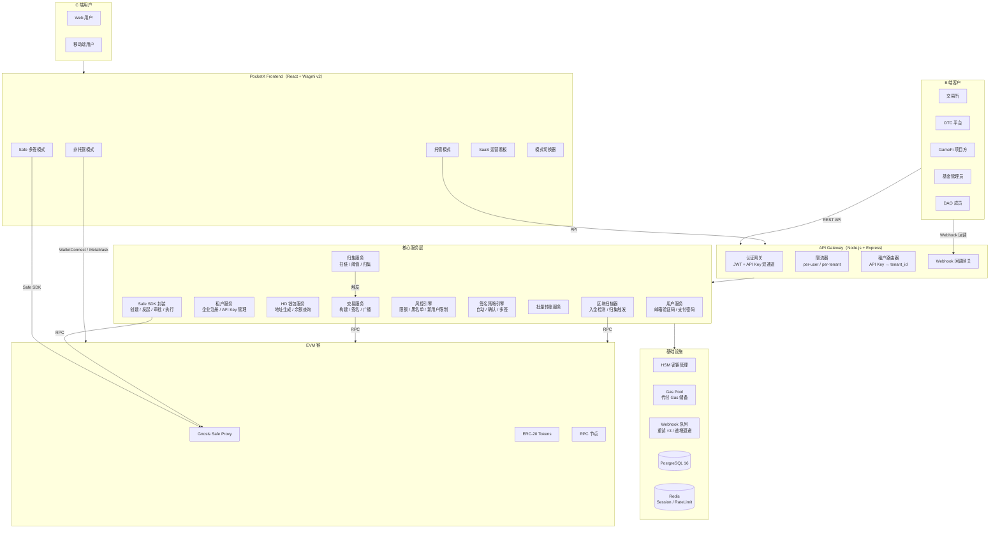
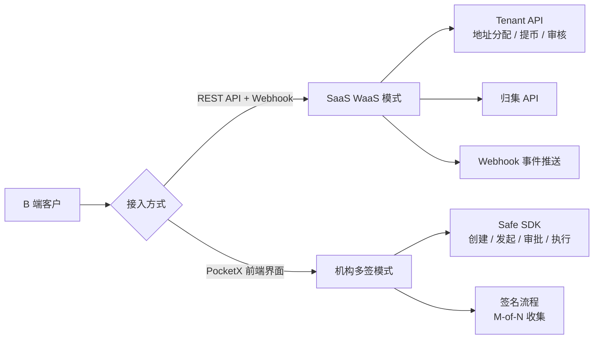
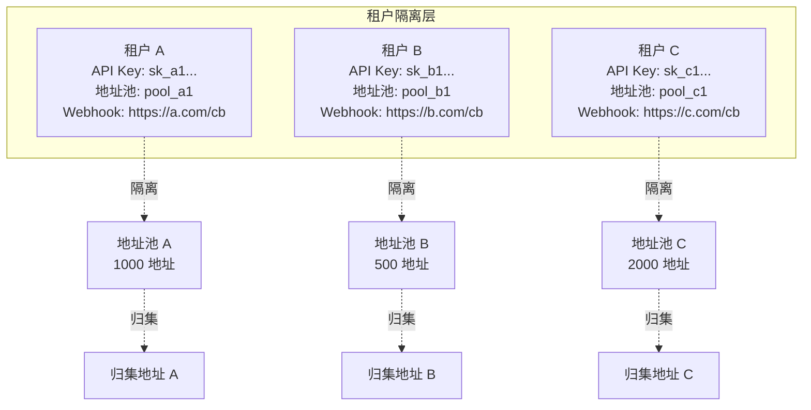

# PocketX v2.0 · 融合中心化钱包 — 技术方案

> 版本：v2.0 | 日期：2026-06-30 | 编制：Team6 架构师
> 基于：PRD v1.2（37 功能 / 22 业务逻辑 / B2B SaaS WaaS + 机构多签双模式）

---

## 一、系统架构

### 1.1 整体架构图



### 1.2 B2B 双模式架构分流



### 1.3 SaaS 模式数据隔离



---

## 二、模块拆解与开发分配

| 模块编号 | 模块 | 描述 | 负责 | 对应 PRD |
|---------|------|------|------|----------|
| **FE-01** | 模式切换器 | 非托管/托管/Safe 三模式无缝切换 | frontend-dev | F-026 |
| **FE-02** | 非托管钱包 UI | 现有 PocketX + Solana 链 | frontend-dev | F-001~017 |
| **FE-03** | 托管钱包注册/登录 | 邮箱验证码→HD→支付密码 | frontend-dev | F-018, L-011 |
| **FE-04** | 托管转账 UI | Send + Gas代付 + 风控反馈 | frontend-dev | F-019, F-021 |
| **FE-05** | 入金通知 & 余额刷新 | Webhook→SSE→弹通知 | frontend-dev | F-020, F-022 |
| **FE-06** | 资产仪表盘（管理端） | 总资产/流水/导出 | frontend-dev | F-024 |
| **FE-07** | 批量转账页面 | 上传 CSV/进度条/明细 | frontend-dev | F-023 |
| **FE-08** | Safe 多签 UI | 创建/发起/签名/执行 | frontend-dev | F-027~032 |
| **FE-09** | 设置 & 模式切换 | 钱包管理/安全设置 | frontend-dev | F-009, F-014 |
| **FE-10** | SaaS 运营看板 UI | 租户视角：地址数/余额/入金/出金/待审 | frontend-dev | F-037 |
| **BE-01** | API 网关 | 鉴权/限流/路由/租户解析 | backend-dev | L-012, L-018 |
| **BE-02** | 用户认证服务 | 邮箱验证码/JWT/Session | backend-dev | L-011 |
| **BE-03** | 租户服务 | 企业注册/API Key 管理/Webhook 配置 | backend-dev | F-033, L-018 |
| **BE-04** | HD 钱包服务 | 创建/导入/地址/余额/地址池管理 | backend-dev | F-018, F-034, L-002, L-019 |
| **BE-05** | 交易服务 | 构建/Gas代付/签名/广播 | backend-dev | F-019, L-003 |
| **BE-06** | 风控引擎 | 限额/日累计/新用户/黑名单（租户级 + 平台级） | backend-dev | F-021, L-005~6 |
| **BE-07** | 签名策略引擎 | 小额自动/中额确认/大额审批 | backend-dev | F-025, L-007 |
| **BE-08** | 区块扫描 & 入金 | 扫块→匹配地址→更新余额→Webhook | backend-dev | F-020, L-004 |
| **BE-09** | Webhook 事件服务 | 队列/重试×3/SSE 推送/租户回调 | backend-dev | F-022, L-008 |
| **BE-10** | 批量转账服务 | 逐笔/部分失败不阻塞 | backend-dev | F-023, L-009 |
| **BE-11** | SaaS 归集服务 | 入金检测→阈值判断→自动归集 | backend-dev | F-035, L-020 |
| **BE-12** | SaaS 提币服务 | 提币请求→审核/免审→打币→回调 | backend-dev | F-036, L-021~22 |
| **BE-13** | Safe SDK 封装 | Safe 创建/发起/审批/执行 | backend-dev | F-027~030 |
| **SC-01** | Safe Proxy Factory | Safe 工厂合约部署 | contract-dev | F-027 |

---

## 三、API 设计

### 3.1 认证（C 端用户）

| 方法 | 路径 | 说明 |
|------|------|------|
| POST | `/api/v2/auth/send-code` | 发送邮箱验证码 |
| POST | `/api/v2/auth/verify-code` | 验证 → JWT |
| POST | `/api/v2/auth/set-password` | 设置支付密码 |
| POST | `/api/v2/auth/refresh` | 刷新 JWT |

### 3.2 钱包（C 端用户）

| 方法 | 路径 | 说明 |
|------|------|------|
| POST | `/api/v2/wallet/create` | 创建托管钱包 |
| POST | `/api/v2/wallet/import` | 导入托管钱包 |
| GET | `/api/v2/wallet/balance` | 查询余额 |
| GET | `/api/v2/wallet/address` | 充值地址 |
| GET | `/api/v2/wallet/transactions` | 交易历史 |

### 3.3 交易（C 端用户）

| 方法 | 路径 | 说明 |
|------|------|------|
| POST | `/api/v2/tx/send` | 转账→风控→签名→广播 |
| POST | `/api/v2/tx/estimate-gas` | 估算 Gas |
| GET | `/api/v2/tx/status/:txHash` | 交易状态 |
| POST | `/api/v2/tx/batch` | 批量转账（管理端） |

### 3.4 风控

| 方法 | 路径 | 说明 |
|------|------|------|
| GET | `/api/v2/risk/limits` | 查询用户限额 |
| POST | `/api/v2/risk/blacklist` | 管理黑名单 |

### 3.5 Webhook / 通知（C 端）

| 方法 | 路径 | 说明 |
|------|------|------|
| GET | `/api/v2/events/stream` | SSE 事件流 |
| POST | `/api/v2/webhooks/cwallet` | CWallet 回调 |

### 3.6 Safe 多签（B2B 模式二）

| 方法 | 路径 | 说明 |
|------|------|------|
| POST | `/api/v2/safe/create` | 创建 Safe（代理 SDK） |
| POST | `/api/v2/safe/propose` | 发起多签提案 |
| POST | `/api/v2/safe/approve` | 签署交易 |
| POST | `/api/v2/safe/execute` | 达到阈值执行 |
| GET | `/api/v2/safe/:address` | Safe 钱包详情 |

### 3.7 SaaS WaaS API（B2B 模式一）⭐ 新增

> **鉴权方式**：Header `X-API-Key: sk_xxx` + HMAC 签名
> **签名算法**：`HMAC-SHA256(body + timestamp, api_secret)`

#### 3.7.1 租户管理

| 方法 | 路径 | 说明 |
|------|------|------|
| POST | `/api/v1/saas/register` | 企业注册 → 返回 tenant_id + api_key + api_secret |
| GET | `/api/v1/saas/tenant` | 查询租户信息 |
| PUT | `/api/v1/saas/tenant/webhook` | 配置 Webhook 回调 URL |
| PUT | `/api/v1/saas/tenant/sweep` | 配置归集地址 + 归集阈值 |
| PUT | `/api/v1/saas/tenant/review-mode` | 设置提币模式（审核/免审） |

#### 3.7.2 地址分配

| 方法 | 路径 | 说明 |
|------|------|------|
| POST | `/api/v1/saas/address` | 创建/获取托管地址（幂等：同 user_id 总是返回同一地址） |
| GET | `/api/v1/saas/address/{user_id}` | 查询 user_id 地址 + 余额 |
| GET | `/api/v1/saas/addresses` | 分页查询租户下所有地址 |
| POST | `/api/v1/saas/addresses/batch` | 批量创建地址（最多 1000 个） |

#### 3.7.3 提币

| 方法 | 路径 | 说明 |
|------|------|------|
| POST | `/api/v1/saas/withdraw` | 发起提币请求 |
| POST | `/api/v1/saas/withdraw/{id}/approve` | 审核通过（审核模式） |
| POST | `/api/v1/saas/withdraw/{id}/reject` | 审核拒绝（审核模式） |
| GET | `/api/v1/saas/withdraw/{id}` | 查询提币状态 |
| GET | `/api/v1/saas/withdraws` | 分页查询提币记录 |

#### 3.7.4 查询

| 方法 | 路径 | 说明 |
|------|------|------|
| GET | `/api/v1/saas/transactions` | 查租户交易流水（支持按 user_id 筛选） |
| GET | `/api/v1/saas/balances` | 查租户各币种总余额 + 待归集金额 |
| GET | `/api/v1/saas/stats` | 运营统计：地址数、日入金、日出金、待审核数 |

#### 3.7.5 请求/响应示例

**分配地址**：
```json
// POST /api/v1/saas/address
// Headers: X-API-Key: sk_xxx, X-Signature: HMAC-SHA256
{ "user_id": "user_123", "label": "张三" }
→ { "code": 0, "data": {
    "user_id": "user_123",
    "address": "0x742d35Cc6634C0532925a3b844Bc1e7f3b4e8A12",
    "chain": "polygon",
    "created_at": "2026-06-30T00:10:00Z"
  } }
```

**发起提币**：
```json
// POST /api/v1/saas/withdraw
{ "user_id": "user_123", "to_address": "0xAbc...",
  "amount": "100", "token": "USDC", "chain": "polygon" }
→ { "code": 0, "data": {
    "withdraw_id": "wd_xxx",
    "status": "pending_review",  // 审核模式
    "status": "processing"       // 免审模式
  } }
```

**Webhook 回调格式**：
```json
// POST {客户配置的 webhook_url}
// Headers: X-PocketX-Event: deposit|withdrawal_result|withdrawal_request
// Headers: X-PocketX-Signature: HMAC-SHA256(payload, secret)
{
  "event": "deposit",
  "tenant_id": "t_xxx",
  "user_id": "user_123",
  "tx_hash": "0x...",
  "amount": "500",
  "token": "USDC",
  "chain": "polygon",
  "address": "0x742d...",
  "block_number": 51234567,
  "timestamp": "2026-06-30T00:10:00Z"
}
```

---

## 四、数据模型

### 4.1 C 端用户 `users`

| 字段 | 类型 | 说明 |
|------|------|------|
| id | UUID | PK |
| email | VARCHAR(255) | 唯一，邮箱注册 |
| payment_password_hash | VARCHAR(255) | bcrypt |
| hd_wallet_id | UUID | FK |
| role | ENUM(user,admin) | |
| created_at | TIMESTAMP | |

### 4.2 SaaS 租户 `tenants` ⭐ 新增

| 字段 | 类型 | 说明 |
|------|------|------|
| id | UUID | PK |
| name | VARCHAR(100) | 企业名称 |
| contact_email | VARCHAR(255) | 企业联系邮箱 |
| status | ENUM(pending,active,suspended) | 租户状态 |
| api_key | VARCHAR(64) | sk_xxx 前缀 |
| api_secret_hash | VARCHAR(255) | HMAC secret hash |
| webhook_url | VARCHAR(500) | 事件回调 URL |
| sweep_address | VARCHAR(42) | 归集目标地址 |
| sweep_threshold | DECIMAL(36,18) | 归集阈值（如 100 USDC） |
| review_mode | ENUM(manual,auto) | 提币审核模式 |
| created_at | TIMESTAMP | |
| updated_at | TIMESTAMP | |

### 4.3 托管地址池 `address_pool` ⭐ 新增

| 字段 | 类型 | 说明 |
|------|------|------|
| id | UUID | PK |
| tenant_id | UUID | FK → tenants |
| external_user_id | VARCHAR(100) | 客户平台的 user_id |
| label | VARCHAR(255) | 可选备注 |
| chain | VARCHAR(20) | eth/polygon/arb/op/bsc/base/solana |
| address | VARCHAR(42) | 链上地址（同 chain + external_user_id 唯一） |
| encrypted_key | TEXT | HSM 引用 |
| status | ENUM(active,locked) | |
| created_at | TIMESTAMP | |

### 4.4 归集记录 `sweep_records` ⭐ 新增

| 字段 | 类型 | 说明 |
|------|------|------|
| id | UUID | PK |
| tenant_id | UUID | FK |
| from_address | VARCHAR(42) | 来源地址 |
| to_address | VARCHAR(42) | 归集目标（tenant.sweep_address） |
| token | VARCHAR(20) | |
| amount | DECIMAL(36,18) | |
| tx_hash | VARCHAR(66) | 归集交易的 tx hash |
| status | ENUM(pending,confirmed,failed) | |
| created_at | TIMESTAMP | |

### 4.5 SaaS 提币请求 `saas_withdrawals` ⭐ 新增

| 字段 | 类型 | 说明 |
|------|------|------|
| id | UUID | PK |
| tenant_id | UUID | FK |
| external_user_id | VARCHAR(100) | |
| from_address | VARCHAR(42) | |
| to_address | VARCHAR(42) | |
| token | VARCHAR(20) | |
| amount | DECIMAL(36,18) | |
| status | ENUM(pending_review,approved,rejected,processing,confirmed,failed) | |
| review_by | VARCHAR(255) | 审核人 |
| review_note | TEXT | 审核备注 |
| tx_hash | VARCHAR(66) | |
| created_at | TIMESTAMP | |
| updated_at | TIMESTAMP | |

### 4.6 托管钱包 `custodial_wallets`

| 字段 | 类型 | 说明 |
|------|------|------|
| id | UUID | PK |
| user_id | UUID | FK |
| chain | VARCHAR(20) | eth/polygon/... |
| address | VARCHAR(42) | 链上地址 |
| encrypted_key | TEXT | HSM 引用 |
| created_at | TIMESTAMP | |

### 4.7 交易 `transactions`

| 字段 | 类型 | 说明 |
|------|------|------|
| id | UUID | PK |
| wallet_id | UUID | FK |
| from/to_address | VARCHAR(42) | |
| amount | DECIMAL(36,18) | |
| token_address | VARCHAR(42) | |
| gas_sponsored | BOOLEAN | |
| tx_hash | VARCHAR(66) | |
| status | ENUM(pending,confirmed,failed,blocked) | |
| risk_result | JSON | |
| created_at | TIMESTAMP | |

### 4.8 风控规则 `risk_rules`

| 字段 | 类型 | 说明 |
|------|------|------|
| id | UUID | PK |
| scope | ENUM(platform,tenant) | 平台级 or 租户级 |
| tenant_id | UUID | FK（scope=tenant 时） |
| rule_type | ENUM | single_limit/daily_limit/new_user/blacklist |
| params | JSON | |
| enabled | BOOLEAN | |
| updated_at | TIMESTAMP | |

### 4.9 Webhook 事件 `webhook_events`

| 字段 | 类型 | 说明 |
|------|------|------|
| id | UUID | PK |
| event_type | ENUM | deposit/withdrawal/failed/blocked/withdrawal_request |
| tenant_id | UUID | FK（SaaS 模式下） |
| user_id | UUID | FK（C 端模式下） |
| payload | JSON | |
| target_url | VARCHAR(500) | 回调 URL |
| retry_count | INT | |
| status | ENUM(pending,delivered,failed) | |
| created_at | TIMESTAMP | |

---

## 五、接口协议

### 5.1 通用响应格式

```json
{ "code": 0, "message": "success", "data": {} }
```

| code | 含义 |
|------|------|
| 0 | 成功 |
| 1001 | 参数错误 |
| 1002 | 未登录（JWT 过期） |
| 1003 | 支付密码错误 |
| 1004 | API Key 无效或已停用 |
| 1005 | HMAC 签名验证失败 |
| 1006 | 租户未激活 |
| 2001 | 余额不足 |
| 2002 | 风控拦截 |
| 2003 | Gas 不足 |
| 2004 | 未达归集阈值 |
| 2005 | 提币审核中不允许重复提交 |
| 3001 | 多签未达阈值 |
| 3002 | 不是该 Safe 的 Owner |
| 4001 | 地址已达上限 |
| 5000 | 内部错误 |

### 5.2 SaaS API 鉴权流程

```
1. 客户请求 → Header: X-API-Key: sk_xxx, X-Timestamp: 1719700000
2. 网关查找 tenant → 取出 api_secret_hash
3. 验证签名: expected = HMAC-SHA256(request_body + timestamp, secret)
4. 验证时间戳: |now - timestamp| ≤ 5 min（防重放）
5. 验证租户状态: status == active
6. 路由到对应 handler → tenant_id 注入上下文
```

### 5.3 CWallet 内部协议

```json
// POST /internal/create-wallet
{ "user_id": "uuid", "chain": "polygon" }
→ { "address": "0x...", "hd_path": "m/44'/60'/0'/0/0" }

// POST /internal/send-tx
{ "from": "0x...", "to": "0x...", "amount": "100",
  "token": "*", "gas_sponsor": true }
→ { "tx_hash": "0x...", "gas_used": "0.0021", "gas_sponsored": true }

// POST /internal/create-address-pool (SaaS)
{ "tenant_id": "uuid", "chain": "polygon", "count": 100 }
→ { "addresses": ["0x...", "0x...", ...] }
```

---

## 六、测试场景清单

### 6.1 CT（合约测试）

| CT-ID | 合约 | 方法 | 场景 |
|-------|------|------|------|
| CT-001 | Safe Proxy Factory | createProxyWithNonce | 创建 Safe |
| CT-002 | Safe Proxy | execTransaction | 单签执行 |
| CT-003 | Safe Proxy | execTransaction | 多签 2/3 执行 |
| CT-004 | Safe Proxy | execTransaction | 签名不足拒绝 |
| CT-005 | ERC-20 | transfer | 托管转账 |
| CT-006 | ERC-20 | transferFrom | Gas 代付 |

### 6.2 AT（API 测试）

| AT-ID | 端点 | 场景 |
|-------|------|------|
| **C 端** | | |
| AT-001 | POST /auth/send-code | 发送邮箱验证码 |
| AT-002 | POST /auth/send-code | 邮箱已注册 |
| AT-003 | POST /auth/verify-code | 验证码错误 |
| AT-004 | POST /wallet/create | 创建钱包 |
| AT-005 | GET /wallet/balance | 查询余额 |
| AT-006 | POST /tx/send | 通过风控转账 |
| AT-007 | POST /tx/send | 超限额拦截 |
| AT-008 | POST /tx/send | 黑名单拦截 |
| AT-009 | POST /tx/send | 新用户限额拦截 |
| AT-010 | POST /tx/batch | 批量转账 |
| AT-011 | POST /safe/create | 创建 Safe |
| AT-012 | Safe propose+approve+execute | 多签全流程 |
| AT-013 | GET /events/stream | SSE 推送 |
| AT-014 | POST /webhooks/cwallet | 入金回调 |
| **B2B 模式一（SaaS WaaS）** | | ⭐ 新增 |
| AT-101 | POST /saas/register | 企业注册→获取 API Key |
| AT-102 | PUT /saas/tenant/webhook | 配置 Webhook URL |
| AT-103 | PUT /saas/tenant/sweep | 配置归集地址+阈值 |
| AT-104 | POST /saas/address | 分配地址（幂等验证） |
| AT-105 | POST /saas/addresses/batch | 批量分配 100 个地址 |
| AT-106 | GET /saas/address/{user_id} | 查询地址+余额 |
| AT-107 | POST /saas/withdraw | 提币请求（审核模式→pending_review） |
| AT-108 | POST /saas/withdraw/{id}/approve | 审核通过 |
| AT-109 | POST /saas/withdraw/{id}/reject | 审核拒绝 |
| AT-110 | POST /saas/withdraw | 提币请求（免审模式→processing） |
| AT-111 | POST /saas/withdraw | 余额不足 |
| AT-112 | GET /saas/balances | 查询租户各币种余额 |
| AT-113 | GET /saas/stats | 运营统计 |
| AT-114 | — | API Key 无效→401 |
| AT-115 | — | HMAC 签名错误→401 |
| AT-116 | — | 租户地址隔离（A 不能查 B 的地址） |

### 6.3 FT（前端测试）

| FT-ID | 页面 | 场景 |
|-------|------|------|
| FT-001 | 首页 | 模式切换 |
| FT-002 | 注册页 | 邮箱→创建 |
| FT-003 | 转账页 | Gas 代付标签显示 |
| FT-004 | 转账页 | 风控拦截提示 |
| FT-005 | 首页 | 入金通知弹窗 |
| FT-006 | Safe 页 | 创建+交易全流程 |
| FT-007 | 仪表盘 | 资产概览 |
| FT-008 | 批量转账 | CSV+进度 |
| FT-009 | SaaS 看板 | 运营数据展示 |
| FT-010 | SaaS 看板 | 提币审核操作 |

---

## 七、开发顺序

### 7.1 第一轮：并行开发（3 工程师）

| 工程师 | 模块数 | 模块 | 产出 |
|--------|--------|------|------|
| frontend-dev | 10 | FE-01~10 | 前端代码 + 页面截图 |
| backend-dev | 13 | BE-01~13 | 后端代码 + API 文档 |
| contract-dev | 1 | SC-01 | 合约代码 + ABI |

### 7.2 第二轮：集成 & 审查

| 角色 | 产出 |
|------|------|
| tester | E2E_TEST_REPORT.md |
| qa | QA_REPORT.md |
| security | SEC_REVIEW_P1.md + _P2.md |
| security-check | SEC_SCAN_P1.md + _P2.md |

### 7.3 新增模块开发要点

| 编号 | 模块 | 关键实现细节 |
|------|------|------------|
| BE-03 | 租户服务 | API Key 生成（`sk_` + crypto.randomUUID），secret 存储 bcrypt hash |
| BE-04 | 地址池 | 同 user_id 幂等（`SELECT FOR UPDATE` + UPSERT），预生成地址池减少创建延迟 |
| BE-11 | 归集服务 | 定时轮询 + 链上事件监听双模式；归集阈值触发；Gas 从租户预付费余额扣除 |
| BE-12 | 提币服务 | 状态机：pending_review→approved→processing→confirmed/failed；免审跳审核；Webhook 推送审核请求 |
| FE-10 | SaaS 看板 | 每分钟自动刷新；图表展示 24h 入金/出金趋势；待审数 badge |

---

> 📋 PRD：`projects/pocketx-cwallet/PRD.md`（v1.2, 37 功能 / 22 业务逻辑）
> 📋 Feishu PRD：[DvDfdukVPozvQqxjW5acEyeZnez](https://www.feishu.cn/docx/DvDfdukVPozvQqxjW5acEyeZnez)
> 📋 Feishu 技术方案：待创建
